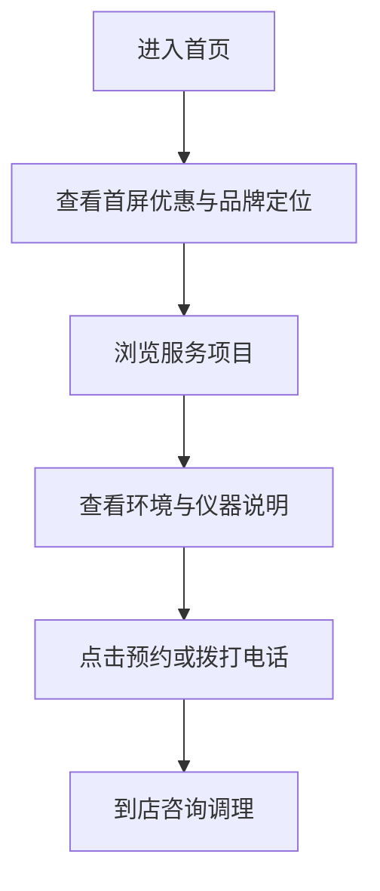

## 1. 产品概述
陈姐·理疗馆首页重设计，目标是将现有静态首页升级为更具信任感、疗愈感和转化力的品牌展示页。
- 解决当前视觉普通、层次弱、预约转化不突出的体验问题，面向本地亚健康调理用户。
- 通过高级东方养生美学、真实服务信息与清晰行动入口，提升咨询与到店预约意愿。

## 2. 核心功能

### 2.1 功能模块
1. **首页**：首屏品牌视觉、服务项目、环境展示、仪器原理、预约转化、联系信息。

### 2.2 页面详情
| 页面名称 | 模块名称 | 功能描述 |
|-----------|-------------|---------------------|
| 首页 | 顶部导航 | 固定导航、移动端菜单、快速预约入口 |
| 首页 | 首屏视觉 | 品牌定位、优惠信息、电话预约、环境主图、信任标签 |
| 首页 | 服务项目 | 展示肩颈、腰椎、头痛头晕、亚健康调理等核心服务 |
| 首页 | 环境展示 | 用图片卡片呈现门店空间，增强真实感 |
| 首页 | 仪器原理 | 用通俗说明呈现理疗仪器价值与适用人群 |
| 首页 | 预约区 | 强化新客优惠与联系方式，引导拨打电话或到店 |
| 首页 | 页脚联系 | 展示地址、电话、营业信息 |

## 3. 核心流程
用户进入首页后，先被首屏视觉和优惠信息吸引，再浏览服务与环境建立信任，最后通过预约按钮、电话或地址完成咨询到店。

## 4. 用户界面设计

### 4.1 设计风格
- 主色：草本深绿、米杏暖白；辅助色：艾草金、陶土橙、墨色文字。
- 按钮：圆角胶囊按钮，主按钮使用深绿底和柔和阴影，次按钮使用描边与浅色背景。
- 字体：保持静态页面兼容，使用本地中文字体栈；通过字重、字距和大标题比例提升质感。
- 布局：桌面优先，采用非对称首屏、层叠卡片、圆角图片、轻纹理背景。
- 图形：使用草本曲线、柔和光晕、细线图标和小型标签，避免廉价模板感。

### 4.2 页面设计概览
| 页面名称 | 模块名称 | UI 元素 |
|-----------|-------------|-------------|
| 首页 | 首屏视觉 | 大标题、优惠胶囊、预约按钮、门店图片、悬浮信息卡、背景纹理 |
| 首页 | 服务项目 | 横向/网格卡片、症状标签、柔和图标、悬停抬升 |
| 首页 | 环境展示 | 图片拼贴、圆角边框、说明文字、阴影层次 |
| 首页 | 仪器原理 | 深色信息带、步骤卡、重点数字 |
| 首页 | 预约区 | 高对比 CTA、电话、地址、优惠说明 |

### 4.3 响应式
桌面优先设计；移动端采用单列布局、收紧间距、保留大按钮和清晰电话入口，优化触摸点击区域。