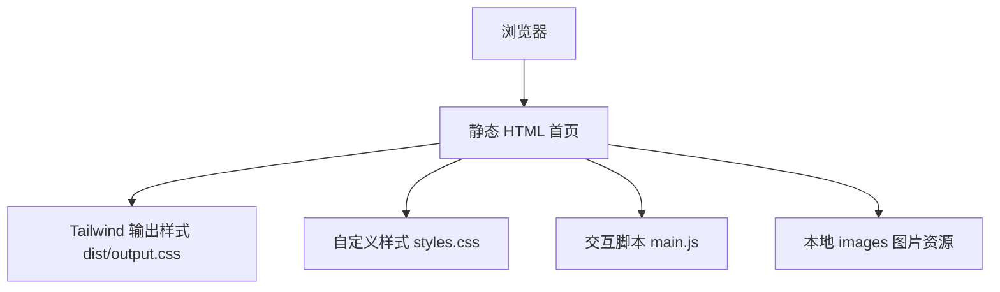

## 1. 架构设计

## 2. 技术说明
- 前端：HTML5 + Tailwind CSS 输出文件 + 自定义 CSS + 原生 JavaScript。
- 构建：沿用现有 `npm run build`，通过 Tailwind CLI 生成 `dist/output.css`。
- 资源：复用现有 `images/*.webp` 门店与人物图片，不新增外部图片依赖。
- 部署：保持静态站点结构，可继续用当前静态服务器或 Cloudflare Pages/Workers 预览。

## 3. 路由定义
| 路由 | 用途 |
|-------|---------|
| / | 首页，展示理疗馆品牌、服务、环境、预约与联系方式 |

## 4. API 定义
无后端 API。预约通过电话、锚点跳转和地址信息完成。

## 5. 数据模型
无数据库。页面内容直接维护在静态 HTML 中，图片放在本地 images 目录。